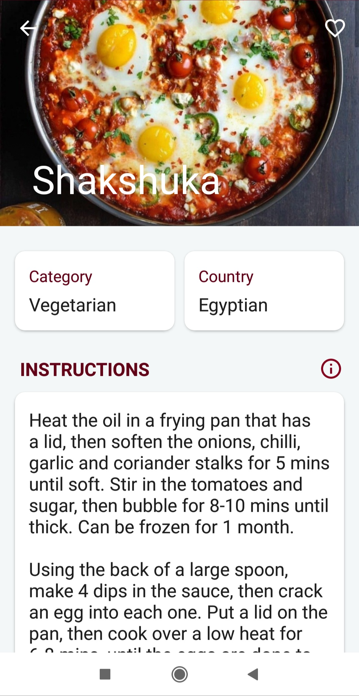

# Food-Recipes
An Android Application  that are fetched Server using JSON and displayed in android using cardview. You can add items to favorites or shopping cart or view general info about food items.

# Android Goodies
<ul>
</li>
<li>Room Database Architecture Component</li>
<li>Mvp (Design Pattern)</li>
<li>Retrofit 2</li>
<li>facebook ShimmerFrameLayout</li>
</ul>

   
  

